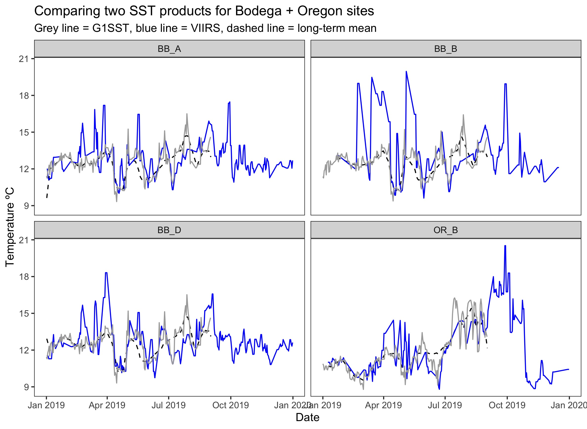
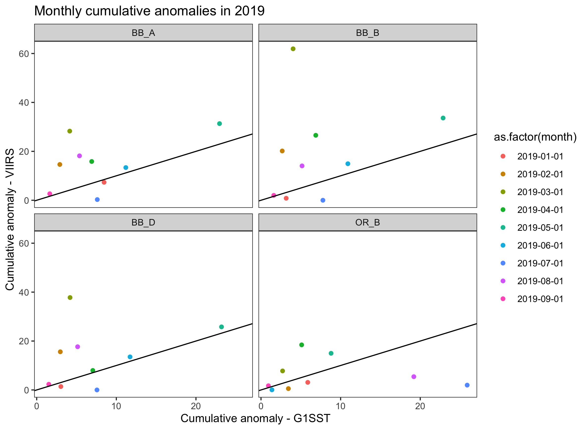

```{r setup, include=FALSE}
knitr::opts_chunk$set(echo = TRUE)
```

## Comparing SST products for Bodega and Oregon sites

### Background

For the eelgrass wasting disease project, we want to use local warming to predict disease (and epifauna, etc.). Local warming means comparing site-level temperatures to the long-term site-level mean temperatures, in order to calculate anomalies. This requires having a long-term record of site-level temperatures, which precludes using HOBO logger data.  

We've explored using satellite remote-sensing sea-surface temperature products for the 2019 analysis. Different products are calculated at different spatial and temporal scales and have different long-term availablity. For the 2019 analysis, the two products were used were:  

1. MUR - Multi-scale Ultra High Resolution SST, with daily temporal resolution and 1 km spatial resolution. Long-term data are available from MUR (since 2002), allowing us to calculate anomalies. 21 of the wasting disease field sites are available.  

2. G1SST - Global 1 km SST, with daily temporal resolution and 1 km spatial resolution. Long-term data are available from G1SST (since 2011), allowing us to calculate anomalies. G1SST provides data for 6 additional sites.   

G1SST and MUR products are very similar - they are composites of sensor and in situ measurements. Very slight differences in the spatial placement of the pixels means we get better coverage of the nearshore meadows by combining the two products compared to using only one SST product. Note that for the 2019 analysis, I calculated anomalies based on the shorter time-frame (9-y) available for the combined SST dataset.   

### Challenge  

Unfortunately, G1SST is not available for dates after 2020-01-01. G1SST was the only source for Bodega Bay sites (none of the six Bodega meadows were available in the MUR product). G1SST also provides data on one Oregon site that is not available from MUR. 

### Goal

I have been looking for alternative satellite products to have temperature coverage of at least some Bodega Bay sites for the 2020 and 2021 analysis. The best alternative I could find is the VIIRS product, which has a spatial resolution of 0.8 km and is produced in a 3-day composite for sites on the West Coast. VIIRS is slightly different from MUR and G1SST - from what I understand, the data product is based on the VIIRS instrument, and is not combined with in situ measurements to produce a modeled output. VIIRS is only available from 2014.

VIIRS data are available for three Bodega sites and one Oregon site that are missing from the MUR dataset.

### Comparison

To determine if combining VIIRS and G1SST is valid for the Bodega/Oregon sites, I plotted the daily temperatures in 2019 from both products against the long-term mean temperatures calculated from the 9-y G1SST dataset. 

  

In the figure, the black dashed line is the long-term mean temperature, based on the 9-y G1SST dataset. The grey line is the G1SST temperatures, and the blue line is the VIIRS temperatures. Although the grey and blue lines track for some parts of the year, the spring temperatures from VIIRS are much higher than the spring temperatures from G1SST. This is problematic because the higher spring temperatures lead to higher cumulative anomalies, and spring is the particular season of interest for the disease and epifauna analysis.  

We can see how the differences affect cumulative anomalies by plotting monthly cumulative anomalies in 2019 for the two datasets.

  

The black line shows the 1:1 line. While some deviation from the 1:1 line is okay, the biggest deviations are all positive and show bigger cumulative anomalies, i.e. warmer temperatures, using VIIRS compared to G1SST.  

### Implications

Because of the warmer VIIRS temperatures, and especially in spring, I don't think it's a good idea to combine the VIIRS and G1SST data sets, i.e. by comparing VIIRS temperatures from 2020 and 2021 to the long-term means cacluated from the G1SST 9-y datset. Therefore, I see the following options for temperature:  

1. Calculate "long-term" temperatures based on the VIIRS dataset from 2014-2021. This is not ideal, because it is a short time period. Also, I think it is questionable because I think the VIIRS temperatures will be warmer than the MUR temperatures in other regions as well (VIIRS is definitely warmer than MUR in San Diego and Oregon). We can't use VIIRS for all the sites because the Alaska and British Colubmia sites are not covered. There are multiple VIIRS products, and I haven't exhaustively examined all of them, but I don't think we have long time-series at sufficient spatial and temporal resolution for all of the wasting disease meadows from the VIIRS products. 

2. Exclude Bodega from the temperature analysis for 2020 and 2021. Very much not a preferred option, but may be inevitable.  

3. Determine some other temperature metric of local warming besides the anomaly relative to long-term, satellite based mean temperatures. I am very open to suggestions here.   

### FYI

Other ways of getting Bodega temperatures that I have investigated:  

- Derive relationship between in situ logger temps and satellite temps, then use in situ records to calculate estimated SST during 2020 and 2021. This is not feasible because of the limited spring logger data (no spring 2019 data because loggers were not deployed until summer 2019, so can't derive a relationship). Also, there are no spring 2020 logger data because most of the loggers failed over the winter, so we can't estimate spring 2020 temperatures regardless. 

- Compare in situ logger temperatures from 2020 and 2021 to long-term means from satellite temperatures. Doesn't work because the in situ temps are warmer than the SSTs, so the anomalies are very high compared to the long-term SST record. Also the data gaps in the in situ logger record (no spring 2019 or 2020 data) makes this not very useful if spring temperatures are predictive of disease/epifauna.   

- Use land surface temperatures of coastal pixels. The reason we have such trouble with the Bodega sites and the SST records is the locations of the sites are often treated as land. With Bo's assistance, I looked at the land surface records from the closest pixels to the Bodega sites. Land surface temperatures are _very_ warm compared to sea surface temperatures. It is possible to derive a relationship between the LST and in situ logger temps, but both of these measures are warmer than the long-term SST means. We could calculate a long-term LST mean, but it would be questionable to compare with other sites (and questionable if that represents what the grass experience).  
