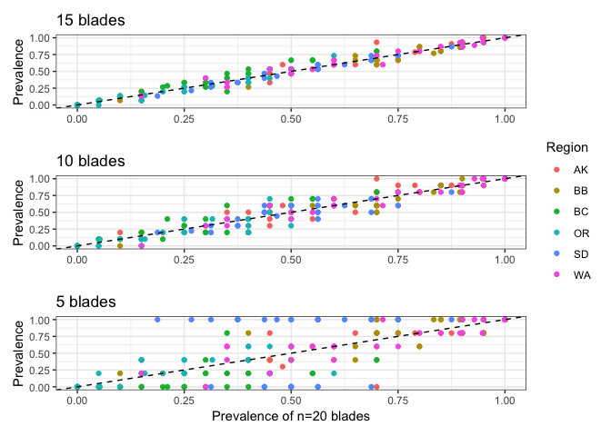
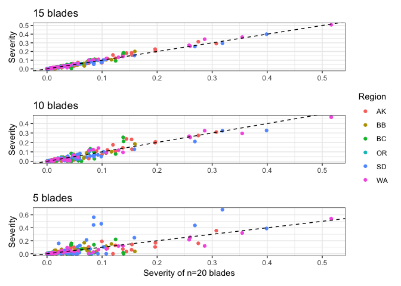
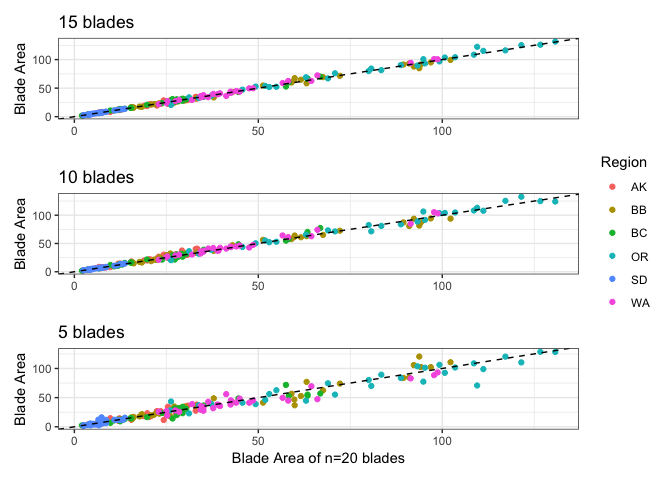
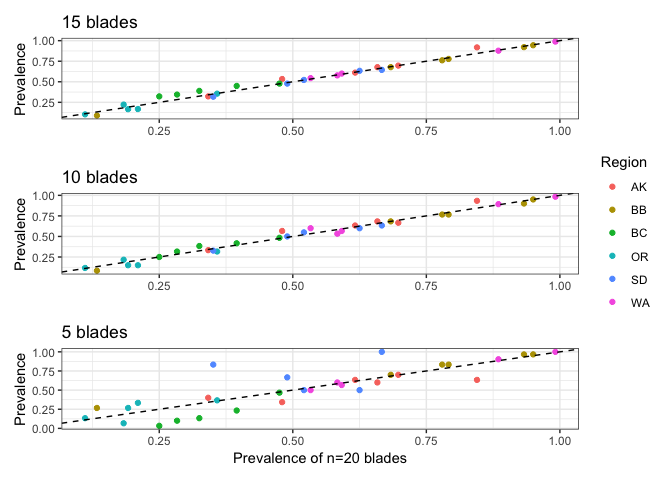
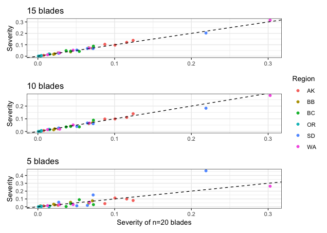
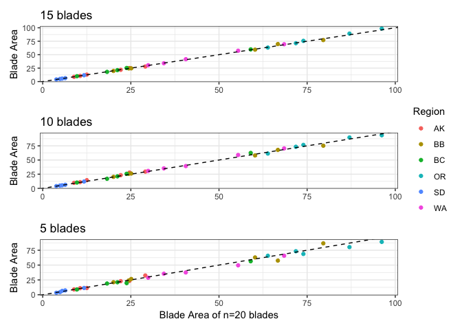

SampleSizeAnalysisDiseaseBlades
================
LRA
4/22/2020

## Sample size for disease surveys

Can we reduce the number of blades collected for analysis of prevalence
and severity?

First look at paired t-tests of Prevalence, Severity, and Blade Area.
Compare transect-level means at each site, for the full sample size (20
blades) and a subsample (15, 10, or 5).

Note the n=5 blades are the epiphyte blades, so they are evenly
distributed along the transects.

### P-values of paired t-tests for n=15

    ##    MeadowId   Severity  Blade Area   Prevalence
    ## 1      AK_A 0.34828265 0.087149667           NA
    ## 2      AK_B 0.52918371 0.007690909 0.5322708853
    ## 3      AK_C 0.62541083 0.755621354 0.0634509305
    ## 4      AK_D 0.05992121 0.542748871 0.0831481144
    ## 5      AK_E 0.53985638 0.675900609 0.9794833371
    ## 6      AK_F 0.20001189 0.821821610 0.1746878143
    ## 7      BB_A 0.45595728 0.431445616 0.2747517867
    ## 8      BB_B 0.54450295 0.045318327 0.5953055494
    ## 9      BB_C 0.23098398 0.310307238 0.8327301029
    ## 10     BB_D 0.56616173 0.228059142 0.3142980124
    ## 11     BB_E 0.26374475 0.787584469 0.0970430999
    ## 12     BB_F 0.38955722 0.354952639 0.6793030667
    ## 13     BC_A 0.27978439 0.096585210 0.9476342438
    ## 14     BC_B 0.05695530 0.549048054 0.0157445127
    ## 15     BC_C 0.81266504 0.921558653 0.0162583413
    ## 16     BC_D 0.05635355 0.647414889 0.0005653555
    ## 17     BC_E 0.15871261 0.211621765 0.0796914696
    ## 18     OR_A 0.25510544 0.441947765 0.3506322903
    ## 19     OR_B 0.30319100 0.738222363 0.1522429059
    ## 20     OR_C 0.44896485 0.045090691 0.2582280125
    ## 21     OR_D 0.19386958 0.408815414 0.8892579521
    ## 22     OR_E 0.65203871 0.183619582 0.0317704575
    ## 23     SD_A 0.03312353 0.558122217 0.9302269626
    ## 24     SD_B 0.02551470 0.460287246 0.0153153250
    ## 25     SD_C 0.04475607 0.701547603 0.5804564346
    ## 26     SD_D 0.26830534 0.610113705 0.0324312792
    ## 27     SD_E 0.27487963 0.290759224 0.4190272976
    ## 28     WA_A 0.17398243 0.025082177 0.8327301029
    ## 29     WA_B 0.64304583 0.183184875 0.5965237621
    ## 30     WA_C 0.19890865 0.729826689 0.3632174676
    ## 31     WA_D 0.44640604 0.749623388 0.7531802100
    ## 32     WA_E 0.79868734 0.334615360 0.6606421552

### P-values of paired t-tests for n=10

    ##    MeadowId   Severity  Blade Area Prevalence
    ## 1      AK_A 0.60498385 0.206734573         NA
    ## 2      AK_B 0.87436811 0.782998113 0.88925795
    ## 3      AK_C 0.53038572 0.060177855 0.08562161
    ## 4      AK_D 0.23474043 0.217763259 0.10705827
    ## 5      AK_E 0.67189215 0.464949443 0.54552237
    ## 6      AK_F 0.53829216 0.205933806 0.74973138
    ## 7      BB_A 0.64665660 0.491787106 0.58968422
    ## 8      BB_B 0.87488462 0.418234991 0.59652376
    ## 9      BB_C 0.14175692 0.787674406 1.00000000
    ## 10     BB_D 0.70710830 0.089604759 0.23854700
    ## 11     BB_E 0.30365963 0.159647731 0.22920497
    ## 12     BB_F 0.51997392 0.200125219 1.00000000
    ## 13     BC_A 0.24874355 0.002813541 0.89451347
    ## 14     BC_B 0.88050187 0.133424611 0.36321747
    ## 15     BC_C 0.66462907 0.980203307 0.10986650
    ## 16     BC_D 0.94968990 0.313238119 1.00000000
    ## 17     BC_E 0.56669677 0.181094010 0.73362978
    ## 18     OR_A 0.31466615 0.062453892 0.86721199
    ## 19     OR_B 0.60062466 0.573865689 0.48376289
    ## 20     OR_C 0.30465951 0.263099633 0.44848823
    ## 21     OR_D 0.20547444 0.115230958 0.47426541
    ## 22     OR_E 0.94572954 0.289975059 0.10986650
    ## 23     SD_A 0.83435044 0.581106531 0.54770845
    ## 24     SD_B 0.02518495 0.469492821 0.37523695
    ## 25     SD_C 0.24036638 0.307849092 0.54160456
    ## 26     SD_D 0.99496554 0.609069738 0.47123492
    ## 27     SD_E 0.41234762 0.538383616 0.82742146
    ## 28     WA_A 0.51696143 0.188336409 0.14381081
    ## 29     WA_B 0.18825158 0.076190528 0.20311066
    ## 30     WA_C 0.28062610 0.268977627 0.36321747
    ## 31     WA_D 0.90143788 0.425888222 0.71011925
    ## 32     WA_E 0.19127716 0.357869643 0.02503102

### P-values of paired t-tests for n=5

    ##    MeadowId   Severity  Blade Area   Prevalence
    ## 1      AK_A 0.34828265 0.087149667           NA
    ## 2      AK_B 0.52918371 0.007690909 0.5322708853
    ## 3      AK_C 0.72751242 0.568742525 0.0647199045
    ## 4      AK_D 0.06239270 0.608491224 0.0907269685
    ## 5      AK_E 0.54161805 0.679245430 0.9808498528
    ## 6      AK_F 0.20001189 0.821821610 0.1746878143
    ## 7      BB_A 0.43732919 0.455055636 0.2858442508
    ## 8      BB_B 0.54450295 0.045318327 0.5953055494
    ## 9      BB_C 0.23098398 0.310307238 0.8327301029
    ## 10     BB_D 0.58309207 0.217033716 0.3217584209
    ## 11     BB_E 0.26374475 0.787584469 0.0970430999
    ## 12     BB_F 0.38955722 0.354952639 0.6793030667
    ## 13     BC_A 0.27978439 0.096585210 0.9476342438
    ## 14     BC_B 0.05695530 0.549048054 0.0157445127
    ## 15     BC_C 0.81266504 0.921558653 0.0162583413
    ## 16     BC_D 0.05635355 0.647414889 0.0005653555
    ## 17     BC_E 0.15977101 0.213712243 0.0819904439
    ## 18     OR_A 0.25265150 0.443971260 0.3422077822
    ## 19     OR_B 0.30319100 0.738222363 0.1522429059
    ## 20     OR_C 0.44896485 0.045090691 0.2582280125
    ## 21     OR_D 0.19386958 0.408815414 0.8892579521
    ## 22     OR_E 0.65203871 0.188462665 0.0317704575
    ## 23     SD_A 0.03312353 0.558122217 0.9302269626
    ## 24     SD_B 0.02551470 0.460287246 0.0153153250
    ## 25     SD_C 0.04475607 0.701547603 0.5804564346
    ## 26     SD_D 0.26128900 0.614630753 0.0336864765
    ## 27     SD_E 0.27487963 0.290759224 0.4190272976
    ## 28     WA_A 0.17398243 0.025082177 0.8327301029
    ## 29     WA_B 0.64304583 0.183184875 0.5965237621
    ## 30     WA_C 0.19571347 0.719060712 0.3632174676
    ## 31     WA_D 0.44887271 0.613294669 0.8752878522
    ## 32     WA_E 0.79868734 0.334615360 0.6606421552

Few significant tests, so statistically we are fairly safe to reduce
sample size.

Now compare correlation between subsamples and full sample

### Transect level plots

Prevalence

<!-- -->

Severity

<!-- -->

Blade Area

<!-- -->

### Meadow level plots

Prevalence

<!-- -->

Severity

<!-- -->

Blade Area

<!-- -->

Overall, we could probably go down to 15 blades per transect and not
lose much information. There will be more spread at transect level, but
the meadow level will look the same.

Blade Area looks fine even with just 5 blades, which is nice to know
since our shoot morphology uses only 5 blades/shoots per transect.
