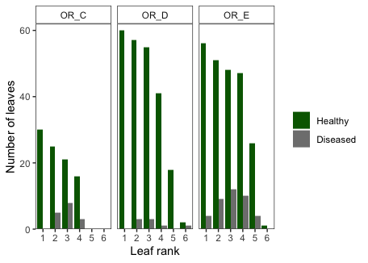

leaf2\_leaf3
================
LRA
10/6/2020

### Leaf 2 vs Leaf 3

Here, I am comparing wasting disease prevalence on leaf 2 and leaf 3 of
plants collected at three of the Oregon sites in 2019.

In Oregon, many eelgrass shoots have only 4 leaves, meaning leaf 3 is an
outer leaf, in contrast to morphology in other regions where most shoots
have 5 or more leaves. Leaves in Oregon are also very
long-lived/persistent, so leaf 3 is likely older and has had more
exposure to disease, relative to leaf 3 in other regions.

In 2019, we collected leaf 2 for analysis at all Oregon sites. This
dataset is a small set of additional shoots, collected at the same tidal
heights but not along the transects. All leaves were analyzed for WD
prevalence. Comparing the prevalence of leaf 2 and 3, leaf 3 does have
WD slightly more often than leaf 2; 23 of 147 leaf 3’s were diseased
compared to 17 out of 150 leaf 2’s. However, there is no statistical
difference in prevalence between leaf 2 and leaf 3, either across all
sites or within each site (assessed using GLMs, see below).

#### Prevalence by leaf rank

    ## New names:
    ## * `total leaf area` -> `total leaf area...23`
    ## * `total leaf area` -> `total leaf area...24`
    ## * `` -> ...25

    ## Warning: Unknown or uninitialised column: `Meadow`.

    ## `summarise()` has grouped output by 'Site', 'Meadow', 'Depth'. You can override using the `.groups` argument.

    ## `summarise()` has grouped output by 'Site', 'Meadow'. You can override using the `.groups` argument.

    ## # A tibble: 16 x 7
    ## # Groups:   Site, Meadow [3]
    ##    Site  Meadow Leaf      n diseased healthy prevalence
    ##    <fct> <chr>  <fct> <int>    <int>   <int>      <dbl>
    ##  1 IF    OR_D   1        60        0      60     0     
    ##  2 IF    OR_D   2        60        3      57     0.05  
    ##  3 IF    OR_D   3        58        3      55     0.0517
    ##  4 IF    OR_D   4        42        1      41     0.0238
    ##  5 IF    OR_D   5        18        0      18     0     
    ##  6 IF    OR_D   6         3        1       2     0.333 
    ##  7 SBN   OR_E   1        60        4      56     0.0667
    ##  8 SBN   OR_E   2        60        9      51     0.15  
    ##  9 SBN   OR_E   3        60       12      48     0.2   
    ## 10 SBN   OR_E   4        57       10      47     0.175 
    ## 11 SBN   OR_E   5        30        4      26     0.133 
    ## 12 SBN   OR_E   6         1        0       1     0     
    ## 13 SBS   OR_C   1        30        0      30     0     
    ## 14 SBS   OR_C   2        30        5      25     0.167 
    ## 15 SBS   OR_C   3        29        8      21     0.276 
    ## 16 SBS   OR_C   4        19        3      16     0.158

<!-- --><!-- -->

The summary table shows that prevalence for leaf 2 was 5-20% at the
three sites and prevalence for leaf 3 was 5-28%. These values are well
within the range of prevalence detected from the NSF survey data on Leaf
2 in July 2019: 0-45% at the transect level, and 11-34% at the site
level.

Additionally, at these three sites, only 30%, 50%, and 0% of shoots had
5 leaves. Again, this shows a contrast to predominant eelgrass
morphology elsewhere.

#### Statistical test

I modeled prevalence (0 or 1) as a function of Leaf Rank (2 or 3) and
Site, using logistic regression (GLM with binomial link function). Leaf
Rank was not significant in determining disease prevalence; the
interaction between Leaf Rank and Site was also not significant.

    ## 
    ## Call:
    ## glm(formula = WD ~ Leaf, family = binomial, data = leaf23)
    ## 
    ## Deviance Residuals: 
    ##     Min       1Q   Median       3Q      Max  
    ## -0.5834  -0.5834  -0.4905  -0.4905   2.0868  
    ## 
    ## Coefficients:
    ##             Estimate Std. Error z value Pr(>|z|)    
    ## (Intercept)  -2.0571     0.2576  -7.987 1.38e-15 ***
    ## Leaf3         0.3723     0.3433   1.084    0.278    
    ## ---
    ## Signif. codes:  0 '***' 0.001 '**' 0.01 '*' 0.05 '.' 0.1 ' ' 1
    ## 
    ## (Dispersion parameter for binomial family taken to be 1)
    ## 
    ##     Null deviance: 234.74  on 296  degrees of freedom
    ## Residual deviance: 233.55  on 295  degrees of freedom
    ## AIC: 237.55
    ## 
    ## Number of Fisher Scoring iterations: 4

    ## 
    ## Call:
    ## glm(formula = WD ~ Leaf * Site, family = binomial, data = leaf23)
    ## 
    ## Deviance Residuals: 
    ##     Min       1Q   Median       3Q      Max  
    ## -0.8035  -0.6039  -0.3259  -0.3203   2.4478  
    ## 
    ## Coefficients:
    ##               Estimate Std. Error z value Pr(>|z|)    
    ## (Intercept)   -2.94444    0.59232  -4.971 6.66e-07 ***
    ## Leaf3          0.03572    0.83805   0.043   0.9660    
    ## SiteSBN        1.20984    0.69395   1.743   0.0813 .  
    ## SiteSBS        1.33500    0.76866   1.737   0.0824 .  
    ## Leaf3:SiteSBN  0.31259    0.96810   0.323   0.7468    
    ## Leaf3:SiteSBS  0.60864    1.05591   0.576   0.5643    
    ## ---
    ## Signif. codes:  0 '***' 0.001 '**' 0.01 '*' 0.05 '.' 0.1 ' ' 1
    ## 
    ## (Dispersion parameter for binomial family taken to be 1)
    ## 
    ##     Null deviance: 234.74  on 296  degrees of freedom
    ## Residual deviance: 219.40  on 291  degrees of freedom
    ## AIC: 231.4
    ## 
    ## Number of Fisher Scoring iterations: 5

    ## Single term deletions
    ## 
    ## Model:
    ## WD ~ Leaf * Site
    ##           Df Deviance    AIC
    ## <none>         219.40 231.40
    ## Leaf:Site  2   219.75 227.75

#### Conclusions

1.  There is no statistical or meaningful difference in disease
    prevalence between Leaf 2 and Leaf 3 at these Oregon sites in 2019.

2.  Therefore, Leaf 2 measurements do not underestimate disease
    prevalence compared to Leaf 3 in other regions.

The main limitation of this analysis is that we only have three of the
five Oregon sites included. Samples from the other two sites were
collected but remain to be analyzed. But using these data, we can
justify the difference in method between OR and the other sites.
