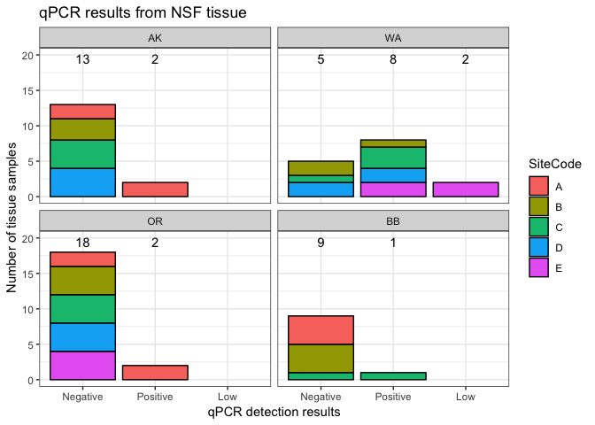
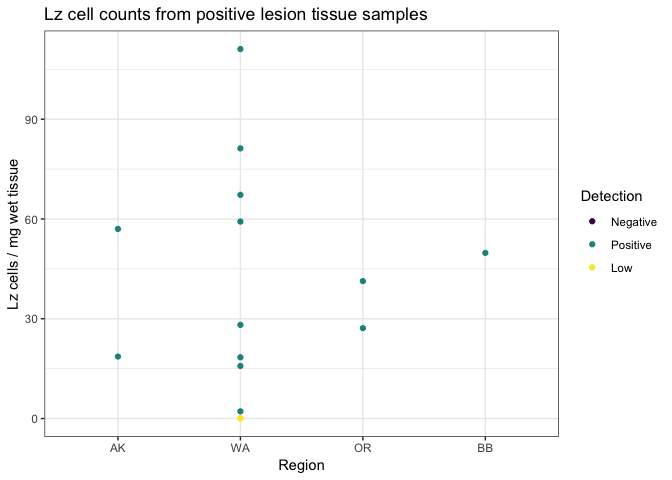

qPCR\_outcomes
================
LRA
5/4/2020

### qPCR outcomes from 2019 NSF samples

NSF lesion and green tissue samples were collected in July/Aug of 2019
and stored in 70% ethanol.

I extracted and analyzed for qPCR 60 lesion samples from 4 regions (AK,
WA, OR, BB).

Positive results (e.g. Lz DNA in the samples) were low: 2/15 in AK,
10/15 in WA, 2/20 in OR, 1/10 in BB.

Good news is that the range of cell counts in other regions fell within
the range found in WA.

Note, the “Low” category is for positive results with \<1 cell /
mg.

<!-- --><!-- -->

### Possible reasons for low rate of positives:

1)  Sample selection - tissue samples were likely not optimal as
    partners have little experience in selecting lesions.

2)  Ethanol storage - it’s possible that the ethanol storage did not
    preserve DNA well, leading to low yields in the extracts. Morgan and
    I ran a methods test in September, by pairing samples from the same
    lesion and flash freezing half while storing the other half in
    ethanol. There was no clear difference, but we again had a low rate
    of positives with the tests.

3)  Primer specificity? We’ve mentioned this a few times, my
    understanding is that there might be adjustments to either the
    primers or to the qPCR method (e.g. using SYBR Green?) that might
    lead to more success.

### Moving forward - 2019

For purposes of the NSF analysis, we want to be able to say we have Lz
in all regions and ideally in all meadows where we find lesions. We can
probably get away with saying that we confirmed Lz in all regions, but
the figures above are not very convincing (especially when we have 10:1
ratio of negatives to positives).

One strategy is that we can run more samples. We collected 12 tissue
samples per meadow (site). For the first round of qPCR anaylsis, I
extracted and analyzed a subset of samples (no more than 4 per meadow).
So, theoretically, we have more tissue samples to run at each site (up
to 8 more per site). However, I tried to select the most promising
lesion tissue samples, based on the scanned images. So the remaining
tissues samples may be slightly worse candidates for qPCR than those
already run. We’d also have to think about the expense of running many
more samples in pursuit of a handful of positives.

Regarding (2) above, we planned to run tests in Colleen’s lab to confirm
the presence of amplifiable DNA in the extracts. Basically, we want to
make sure that the ethanol storage isn’t compromising DNA extraction.
The plan was to run universal eukaryotic primers to confirm there is any
DNA in the samples (eelgrass or Lz). This would eliminate sample
collection and extraction as sources of error.

Assuming we do have DNA in the extracts, we could do further methods
development (e.g. address (3) above). This would likely need to happen
in Colleen’s lab, with Colleen or Tori assisting Lillian :)

Note, I am currently planning to extract and run additional 2019 samples
from the remaining regions (BC, SD, more BB) in June 2020. I expect to
have low success rates with these samples as well. Potentially, we could
think about adjusting the extraction methods - possibly using a
different kit? When we last talked it didn’t sound like this would be
very fruitful, but we could try it. Not sure if there are any other
changes we could make, with the equipment at FHL, to improve success
rates.

### Moving forward - 2020

We need to decide on our sampling plan for summer 2020 within the next
few weeks. A few possibilities:

1)  Ask partners to take the same approach as last year - e.g. identify
    lesions in the field, store in ethanol.

2)  Ask partners to ship us fresh eelgrass from the field so we can
    identify lesions and flash freeze, rather than use ethanol.

3)  Possibly use an alternative preservation, such as drying in silica?

One issue with choosing a new method is that we don’t actually know
what/if there’s an issue with the 2019 method. We likely won’t have any
additional information to make that decision. Possibly sometime this
summer we will be able to do the tests to confirm that the ethanol
preservation is okay, but we can’t do those tests under current
conditions.

Given this situation, my suggestion is that we ask partners to collect
lesion samples at a subset of sites using the same methods as last year.
At least it will be comparable, but we can reduce the effort if it turns
out that there is an issue with the preservation.

A final thought - Deanna (Jay’s postdoc) has mentioned that she has
tissue leftover from the microbiome sampling (those tissue samples were
preserved in Zymo buffer, and she analyzed the solution, not the
tissue). We could investigate if the Zymo buffer is compatible with the
kit extraction, and perhaps try running some 2019 microbiome tissue
samples for qPCR.
