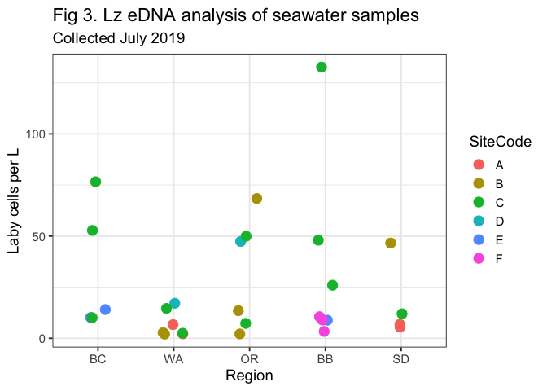

## Latitudinal wasting disease: eDNA and qPCR results

This document provides a summary of qPCR and eDNA results from the
latitudinal wasting disease surveys.

These results may be of interest to the EEID project team, as these
samples can be used for sequencing or to inform new sample plans.

## qPCR

### Background

For the latitudinal wasting disease surveys, the goal of the qPCR
analysis has been to confirm the presence of the pathogen (Labyrinthula
zosterae) across the study sites. In 2019, we attempted to do this with
lesion tissue samples preserved by team partners at each site. However,
many of those samples were negative for Lz, likely due to poor sample
selection (e.g. selecting tissue that is not a lesion or that is too
degraded to return a positive result for Lz).

In 2020, we (FHL team) received fresh tissue samples from Bodega Bay and
San Diego and did the lesion selection at FHL. This process had a better
outcome for Bodega Bay (\~3/5 samples were positive for Lz, which is on
par with sample selection outcomes in the San Juan Islands). For San
Diego, the samples we received were highly suspect and we did not have
any positives.

In 2021, we (FHL team) received fresh tissue samples from all the
partner sites and did the lesion selection at FHL, except Oregon where
LRA did the sample selection with the Oregon team. Samples were
preserved in ethanol and extracted about 3 months later (late October).
Note, we preserved and extracted samples from 3 sites per region in most
cases (we only asked for tissue from three sites per region). Alsaka and
British Columbia sent us samples from additional sites, which we also
preserved. We preserved more samples than were extracted (between 10 and
18 per site). We also attempted to preserve some of the ‘Crescent’
morphology lesions, which occured at a subset of sites.

Results of the extraction are shown below.

### Results

Figure 1 shows the number of lesion tissue samples that registered as
positive, negative, and low for Laby DNA. The ‘low’ samples indicate the
sample was positive but at a calculated value below 1 cell per mg dried
tissue. These are likely positives, but perhaps less biologically
meaningful. Each region had at least two sites with positive Lz DNA in
lesion tissue.

We also extracted and ran paired green tissue with each of these samples
(from the base of the infected leaf). Green tissue samples were all
negative.

Figure 2 shows the Lz cells per mg of dry tissue across sites. Most cell
counts were below 500 cells/mg, with the exception of the positive
sample from Bodega Bay-D (a site in Bodega Bay proper), which had cell
counts of almost 2000 cells/mg.

The following three tables show the number of samples that were
extracted per site (Table 1) and the number of samples that are still
preserved, including conventional lesions (Table 2) and crescent lesions
(Table 3). These samples are not needed for the latitudinal wasting
disease surveys but can be repurposed for sequencing to look at Lz
variants across space.

<table>
<caption>
Table 1. Number of lesion samples run for qPCR in 2021
</caption>
<thead>
<tr>
<th style="text-align:left;">
Region
</th>
<th style="text-align:left;">
SiteCode
</th>
<th style="text-align:right;">
NumberSamples
</th>
</tr>
</thead>
<tbody>
<tr>
<td style="text-align:left;">
AK
</td>
<td style="text-align:left;">
A
</td>
<td style="text-align:right;">
5
</td>
</tr>
<tr>
<td style="text-align:left;">
AK
</td>
<td style="text-align:left;">
D
</td>
<td style="text-align:right;">
5
</td>
</tr>
<tr>
<td style="text-align:left;">
AK
</td>
<td style="text-align:left;">
E
</td>
<td style="text-align:right;">
5
</td>
</tr>
<tr>
<td style="text-align:left;">
AK
</td>
<td style="text-align:left;">
F
</td>
<td style="text-align:right;">
3
</td>
</tr>
<tr>
<td style="text-align:left;">
BC
</td>
<td style="text-align:left;">
A
</td>
<td style="text-align:right;">
4
</td>
</tr>
<tr>
<td style="text-align:left;">
BC
</td>
<td style="text-align:left;">
B
</td>
<td style="text-align:right;">
2
</td>
</tr>
<tr>
<td style="text-align:left;">
BC
</td>
<td style="text-align:left;">
D
</td>
<td style="text-align:right;">
5
</td>
</tr>
<tr>
<td style="text-align:left;">
BC
</td>
<td style="text-align:left;">
E
</td>
<td style="text-align:right;">
4
</td>
</tr>
<tr>
<td style="text-align:left;">
WA
</td>
<td style="text-align:left;">
A
</td>
<td style="text-align:right;">
5
</td>
</tr>
<tr>
<td style="text-align:left;">
WA
</td>
<td style="text-align:left;">
B
</td>
<td style="text-align:right;">
5
</td>
</tr>
<tr>
<td style="text-align:left;">
WA
</td>
<td style="text-align:left;">
E
</td>
<td style="text-align:right;">
5
</td>
</tr>
<tr>
<td style="text-align:left;">
OR
</td>
<td style="text-align:left;">
B
</td>
<td style="text-align:right;">
11
</td>
</tr>
<tr>
<td style="text-align:left;">
OR
</td>
<td style="text-align:left;">
C
</td>
<td style="text-align:right;">
6
</td>
</tr>
<tr>
<td style="text-align:left;">
OR
</td>
<td style="text-align:left;">
D
</td>
<td style="text-align:right;">
6
</td>
</tr>
<tr>
<td style="text-align:left;">
BB
</td>
<td style="text-align:left;">
A
</td>
<td style="text-align:right;">
5
</td>
</tr>
<tr>
<td style="text-align:left;">
BB
</td>
<td style="text-align:left;">
D
</td>
<td style="text-align:right;">
5
</td>
</tr>
<tr>
<td style="text-align:left;">
BB
</td>
<td style="text-align:left;">
F
</td>
<td style="text-align:right;">
5
</td>
</tr>
<tr>
<td style="text-align:left;">
SD
</td>
<td style="text-align:left;">
A
</td>
<td style="text-align:right;">
5
</td>
</tr>
<tr>
<td style="text-align:left;">
SD
</td>
<td style="text-align:left;">
B
</td>
<td style="text-align:right;">
5
</td>
</tr>
<tr>
<td style="text-align:left;">
SD
</td>
<td style="text-align:left;">
C
</td>
<td style="text-align:right;">
5
</td>
</tr>
</tbody>
</table>
<table>
<caption>
Table 2. Number of preserved conventional lesion samples
</caption>
<thead>
<tr>
<th style="text-align:left;">
Region
</th>
<th style="text-align:left;">
SiteCode
</th>
<th style="text-align:right;">
NumberSamples
</th>
</tr>
</thead>
<tbody>
<tr>
<td style="text-align:left;">
AK
</td>
<td style="text-align:left;">
A
</td>
<td style="text-align:right;">
6
</td>
</tr>
<tr>
<td style="text-align:left;">
AK
</td>
<td style="text-align:left;">
D
</td>
<td style="text-align:right;">
7
</td>
</tr>
<tr>
<td style="text-align:left;">
AK
</td>
<td style="text-align:left;">
E
</td>
<td style="text-align:right;">
9
</td>
</tr>
<tr>
<td style="text-align:left;">
AK
</td>
<td style="text-align:left;">
F
</td>
<td style="text-align:right;">
11
</td>
</tr>
<tr>
<td style="text-align:left;">
BC
</td>
<td style="text-align:left;">
A
</td>
<td style="text-align:right;">
5
</td>
</tr>
<tr>
<td style="text-align:left;">
BC
</td>
<td style="text-align:left;">
C
</td>
<td style="text-align:right;">
3
</td>
</tr>
<tr>
<td style="text-align:left;">
BC
</td>
<td style="text-align:left;">
D
</td>
<td style="text-align:right;">
6
</td>
</tr>
<tr>
<td style="text-align:left;">
BC
</td>
<td style="text-align:left;">
E
</td>
<td style="text-align:right;">
3
</td>
</tr>
<tr>
<td style="text-align:left;">
BC
</td>
<td style="text-align:left;">
NA
</td>
<td style="text-align:right;">
2
</td>
</tr>
<tr>
<td style="text-align:left;">
WA
</td>
<td style="text-align:left;">
A
</td>
<td style="text-align:right;">
5
</td>
</tr>
<tr>
<td style="text-align:left;">
WA
</td>
<td style="text-align:left;">
B
</td>
<td style="text-align:right;">
5
</td>
</tr>
<tr>
<td style="text-align:left;">
WA
</td>
<td style="text-align:left;">
E
</td>
<td style="text-align:right;">
10
</td>
</tr>
<tr>
<td style="text-align:left;">
OR
</td>
<td style="text-align:left;">
C
</td>
<td style="text-align:right;">
4
</td>
</tr>
<tr>
<td style="text-align:left;">
OR
</td>
<td style="text-align:left;">
D
</td>
<td style="text-align:right;">
3
</td>
</tr>
<tr>
<td style="text-align:left;">
BB
</td>
<td style="text-align:left;">
D
</td>
<td style="text-align:right;">
1
</td>
</tr>
<tr>
<td style="text-align:left;">
BB
</td>
<td style="text-align:left;">
F
</td>
<td style="text-align:right;">
2
</td>
</tr>
<tr>
<td style="text-align:left;">
SD
</td>
<td style="text-align:left;">
A
</td>
<td style="text-align:right;">
4
</td>
</tr>
<tr>
<td style="text-align:left;">
SD
</td>
<td style="text-align:left;">
B
</td>
<td style="text-align:right;">
8
</td>
</tr>
<tr>
<td style="text-align:left;">
SD
</td>
<td style="text-align:left;">
C
</td>
<td style="text-align:right;">
6
</td>
</tr>
</tbody>
</table>
<table>
<caption>
Table 3. Number of preserved crescent lesion samples
</caption>
<thead>
<tr>
<th style="text-align:left;">
Region
</th>
<th style="text-align:left;">
SiteCode
</th>
<th style="text-align:right;">
NumberSamples
</th>
</tr>
</thead>
<tbody>
<tr>
<td style="text-align:left;">
AK
</td>
<td style="text-align:left;">
A
</td>
<td style="text-align:right;">
4
</td>
</tr>
<tr>
<td style="text-align:left;">
AK
</td>
<td style="text-align:left;">
D
</td>
<td style="text-align:right;">
3
</td>
</tr>
<tr>
<td style="text-align:left;">
AK
</td>
<td style="text-align:left;">
E
</td>
<td style="text-align:right;">
1
</td>
</tr>
<tr>
<td style="text-align:left;">
BC
</td>
<td style="text-align:left;">
NA
</td>
<td style="text-align:right;">
7
</td>
</tr>
<tr>
<td style="text-align:left;">
OR
</td>
<td style="text-align:left;">
D
</td>
<td style="text-align:right;">
1
</td>
</tr>
<tr>
<td style="text-align:left;">
BB
</td>
<td style="text-align:left;">
A
</td>
<td style="text-align:right;">
14
</td>
</tr>
<tr>
<td style="text-align:left;">
BB
</td>
<td style="text-align:left;">
D
</td>
<td style="text-align:right;">
4
</td>
</tr>
<tr>
<td style="text-align:left;">
BB
</td>
<td style="text-align:left;">
F
</td>
<td style="text-align:right;">
4
</td>
</tr>
<tr>
<td style="text-align:left;">
SD
</td>
<td style="text-align:left;">
A
</td>
<td style="text-align:right;">
9
</td>
</tr>
<tr>
<td style="text-align:left;">
SD
</td>
<td style="text-align:left;">
C
</td>
<td style="text-align:right;">
10
</td>
</tr>
</tbody>
</table>

Note, the BC sites with SiteCode of ‘NA’ are sites that are not included
in the wasting disease surveys, but they sent us samples (e.g. Hakai
Dock). There were a few crescents among these samples that might be
worth testing.

Across all sites, there are remaining 100 conventional lesion tissue
samples and 57 crescent lesion tissue samples.

## eDNA

### Background

In 2019, we collected water samples across all the latitudinal wasting
disease survey sites for microbiome analysis. We then used the Lz qPCR
assay to detect environmental pathogen loads in these water samples.
Results are shown in Figure 3 below.

In 2021, we collected water samples at the survey sites in the San Juan
Islands only for additional eDNA analysis. These samples were filtered
and the filters were frozen and stored in the -80 at FHL. Table 4 shows
the number of eDNA filters preserved and awaiting extraction and
processing.

We used comparable methods in 2021 and 2019 (500 mL samples, filtered in
the lab using the same type of filtration unit). However, sampling in
2019 was uniformly on a falling tide, whereas sampling in 2021 was in
some cases after the surveys on the rising tide.

### Results

Figure 3 shows the environmental cell counts from samples at all sites.
Note that Alaska doesn’t appear beause no samples from Alaska came up
positive for Lz. Also note there was no sampling control for these
samples.

<!-- -->

Table 4 shows the samples collected in 2021 that need to be processed.
The grand total of all samples and controls is 67.

<table>
<caption>
Table 4. Number of water samples collected for eDNA in 2021
</caption>
<thead>
<tr>
<th style="text-align:left;">
Region
</th>
<th style="text-align:left;">
SiteCode
</th>
<th style="text-align:left;">
SiteName
</th>
<th style="text-align:right;">
NumberSamples
</th>
<th style="text-align:right;">
NumberControl
</th>
</tr>
</thead>
<tbody>
<tr>
<td style="text-align:left;">
WA
</td>
<td style="text-align:left;">
A
</td>
<td style="text-align:left;">
Fourth of July
</td>
<td style="text-align:right;">
18
</td>
<td style="text-align:right;">
1
</td>
</tr>
<tr>
<td style="text-align:left;">
WA
</td>
<td style="text-align:left;">
B
</td>
<td style="text-align:left;">
False Bay
</td>
<td style="text-align:right;">
18
</td>
<td style="text-align:right;">
1
</td>
</tr>
<tr>
<td style="text-align:left;">
WA
</td>
<td style="text-align:left;">
D
</td>
<td style="text-align:left;">
North Cove
</td>
<td style="text-align:right;">
9
</td>
<td style="text-align:right;">
1
</td>
</tr>
<tr>
<td style="text-align:left;">
WA
</td>
<td style="text-align:left;">
E
</td>
<td style="text-align:left;">
Indian Cove
</td>
<td style="text-align:right;">
18
</td>
<td style="text-align:right;">
1
</td>
</tr>
</tbody>
</table>
