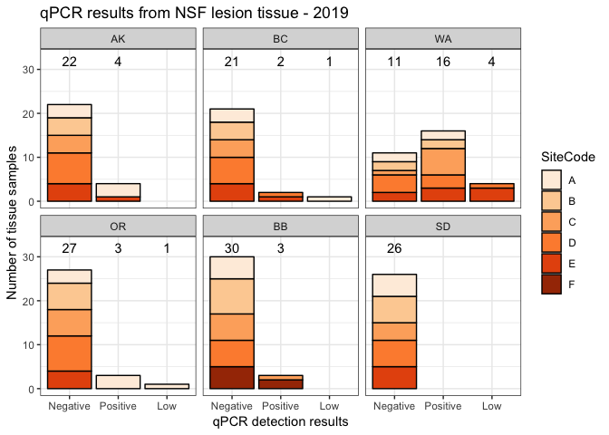
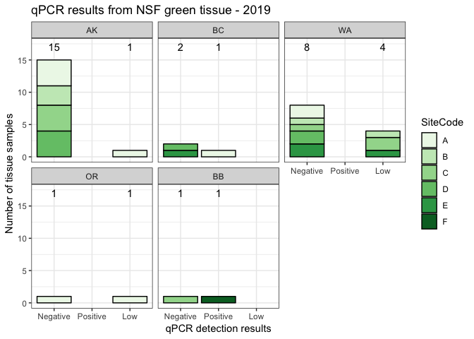
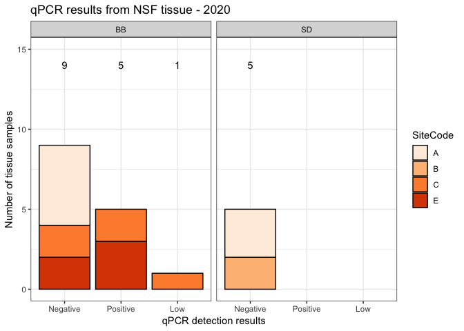
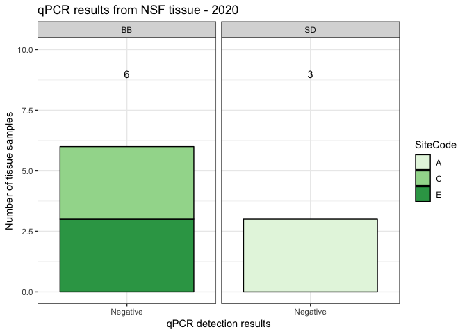
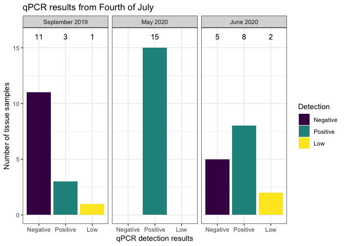
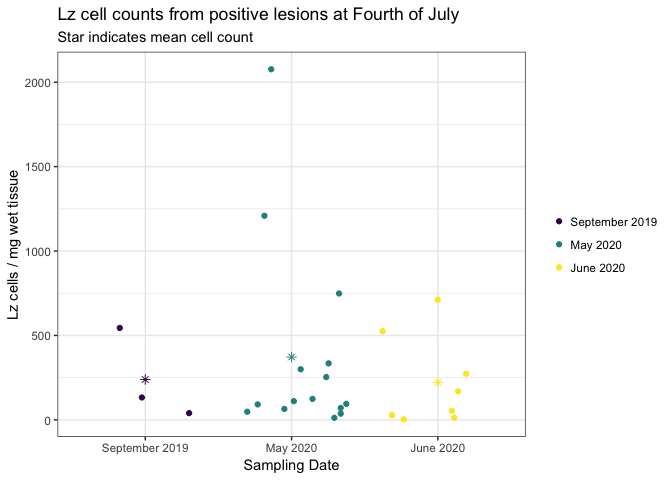

qPCR\_outcomes\_v2
================
LRA
8/27/2020

## Updated qPCR outcomes from 2019 and 2020 samples

### 2019 NSF Samples

NSF lesion and green tissue samples were collected in July/Aug of 2019
and stored in 70% ethanol.

I extracted and analyzed for qPCR between 24-33 lesion samples for each
region.

Some samples had very low Lz cell counts (\<1 cell/mg tissue). I
excluded these low values from the positives as not biologically
meaningful.

Lesion tissue tested positive for Lz cells in 51% of WA samples but
positives were 0-15% of samples at other sites.

<!-- -->

After running the lesion tissue, I identified the paired green tissue
samples for any lesions that were positive for Lz, plus 10 additional
green tissue samples from AK. I extracted and ran a total of 35 green
tissue samples.

A fraction of the green tissue samples did show a positive presence of
Lz, but at very low quantities (\<1 cell/mg tissue). I again excluded
these low results as not biologically meaningful, leaving only 2 true
positives from the green tissue.

<!-- -->

Note, no green tissue was processed for SD because no lesion tissue
tested positive for Lz for SD.

#### Take-aways from the 2019 samples:

1)  Lesion selection is a major factor in finding lesions that test
    positive for Lz. Even in WA, with more experience in lesion
    selection, only ~50% of samples were positive.

2)  There may be geographic effects. No positives were found in any site
    in the SD region, and in other regions besides WA, positives were
    found at only 1 or 2 sites.

3)  Key question - does the qPCR test result represent an *active*
    infection? I.e. lesion tissue that tests negative may still have had
    Lz present to stimulate the visible plant immune response, but the
    Lz are no longer present in the tissue. This would mean the qPCR
    assay can detect active infection but can’t rule out previously
    active infection.

### 2020 NSF Samples

In 2020, we asked Bodega and San Diego to ship fresh tissue to FHL so we
could optimize lesion selection and preservation. We targeted lesions
from Leaf 2 (youngest and freshest tissue) and we targeted lesions with
a clear dark edge and evidence of rapid expansion (jagged lines and dark
center).

I extracted and ran 15 lesion samples from Bodega sites (5 from each of
3 sites) and 5 lesion samples from San Diego (2 sites).

At BB-A, all 5 lesion tissue samples were negative. At BB-C, 2 tissue
samples were positive. At BB-E, 3 tissue samples were positive. All 5
lesion tissue samples were negative at the San Diego
sites.

<!-- --><!-- -->

#### Take-aways from the 2020 samples:

1)  With improved lesion selection, we can identify more positives,
    i.e. it was worth it to have Bodega ship us tissue.

2)  Even with optimal lesion selection, not all sites will show
    positives (e.g. BB-A). It’s possible we could’ve gotten one or two
    positives from running additional BB-A samples, but that would still
    give us \<20% positivity. Again, do we think Lz is not present at
    these sites? Or is there something about the dynamics of infection,
    e.g. Lz may leave the tissue rapidly after immune response? Plants
    in Bodega are also long-lived, so even Leaf 2 tissue may be weeks
    old.

3)  Tissue from San Diego is questionable (Phyllospadix?) but we found
    no positives in either 2019 (n=26) or 2020 (n=5) samples.

### Repeated sampling at Fourth of July beach, WA

We did repeated sampling at Fourth of July to test the ethanol storage
method and to improve the lab processing method. In Sept 2019, May 2020,
and June 2020, we selected and preserved 15 lesions from Fourth of July.
I extracted and ran these samples within days of sample preservation for
the Sept 2019 and June 2020 samples and about 1 month after preservation
for the May 2020 samples.

Note, paired green tissue from these samples is in storage, and can be
processed if need
be.

<!-- --><!-- -->

#### Take-aways from WA tests

1)  Ethanol storage does not compromise cell counts

2)  Timing of sampling is important - does infection come in waves? High
    cell counts found in May 2020 were not repeated in June 2020, and
    overall infection severity was anecdotally lower (can verify this
    with EELISA later). Catching high cell counts and/or a high
    proportion of positives may depend on when sampling occurs relative
    to unknown infection dynamics.
